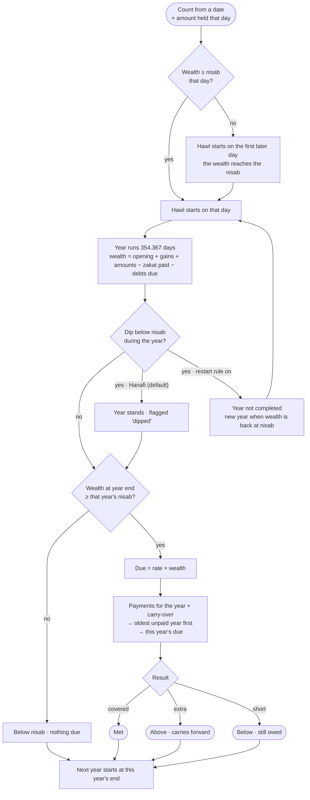

# Zakat Calculator

**Live page: https://offport.github.io/ZakatCalculator/** — open it on your phone or desktop, nothing to install.

A small, local-first web page that keeps track of your zakat years. You pick the day you want to
count from and what you held that day; the zakat year begins the first day that wealth is at the
nisab. Add what you gain each month, any amounts on particular dates, and debts that are due;
record the zakat you pay. For every completed zakat year it shows the wealth at the year's end
(after debts), whether it was above the nisab at that year's gold or silver price, the zakat that
was due, what was paid for that year, and a verdict — **met**, **above** or **below** — with the
amount. Payments settle the oldest unpaid year first, an *Outstanding* total shows what is still
owed, the year in progress is projected, and a graph shows the wealth over time against the nisab.

```
count from a date  →  hawl begins when wealth ≥ nisab  →  a lunar year (354 days)  →  due = 2.5 % × wealth at year end (after debts)
+ monthly gains · dated amounts · debts · zakat paid                                    →  payments settle the oldest year first  →  met / above / below
```

Static files only — no server, no build, no external scripts, no network at all. Everything you
enter stays in your browser (optionally encrypted with a passphrase). Made for phones first.

---

## What it is — and what it is not

**It is**

- **A zakat-year ledger for one pool of money**: savings and cash you describe as an opening
  amount, monthly gains, dated amounts (in or out) and debts due.
- **Automatic about the year**: the hawl starts on the first day the wealth reaches the nisab,
  runs a lunar year (354.367 days), and the next year starts where the last one ended. Dates are
  shown in both the Gregorian and the Hijri calendar.
- **Honest about each year**: what was held at the year's end, the nisab at that year's own gold
  or silver price, the 2.5 % due, what was paid, what was carried over, what is still owed.
- **Arrears-first**: a payment clears the oldest unpaid year before its own, the way a debt is
  settled. The cards show what went where.
- **Local**: a static page. Your data lives in your browser's local storage on this device; a
  passphrase can encrypt it (AES-256-GCM, Web Crypto). *Backup* downloads a JSON file; *Restore*
  loads one. There is no account, no server, no sync.
- **Explainable**: every verdict is a sentence that says how it was reached, and every rule is
  written below and in the page itself.

**It is not**

- **Not a fatwa.** It is arithmetic on the numbers you enter. Schools differ on details; the
  defaults follow the Hanafi view where they differ (see *Assumptions* on the page) and the
  other view is a switch. Ask a scholar for your circumstances.
- **Not a full asset calculator.** Gold jewellery, business stock, shares, property, money owed
  *to* you — enter their zakatable value as a dated amount if you want them counted.
- **Not connected to anything.** No live gold price (the page's security policy forbids network
  calls on purpose); you type today's price and, if you like, each year's.
- **Not multi-user or multi-currency.** One person, one browser, one currency.

---

## How a year is judged



---

## Input and output

### Input — five cards

| Card | What you enter | Notes |
|---|---|---|
| **1 · Start & settings** | the date to count from, the amount held that day, currency (pick or type), lunar/solar year, rate, nisab from gold / silver / an amount, today's price, a price per zakat year, grace days, three rules | the year begins the first day the wealth is at the nisab; switch that off to count from the date regardless |
| **2 · Monthly gains** | amount per month, from which date, optionally until when | accrues on the same day every month; salary savings, rent, profit |
| **3 · Amounts on a date** | date, amount, note | a bonus, an inheritance, a sale; **negative** for money that left |
| **4 · Debts due** | amount, due from which date, optionally the date it was settled | deducted while outstanding; long-term debt is usually only deducted for the instalments due within the year |
| **5 · Zakat paid** | date, amount, optionally the year it is for | matched to a year automatically (grace window after a year end → that year; otherwise an advance for the year in progress) |

Tap any row to edit it (the form switches to *Update*), ✕ to remove it. Lists longer than five
rows scroll inside the card. Everything saves as you type.

### Output — card 6, *Your zakat years*

- **The strip**: today (with the Hijri date), wealth today, the nisab, the rate, and — when
  something is owed from earlier years — *Outstanding*.
- **The graph**: zakatable wealth as a step line from the hawl start to the end of the current
  year (solid to today, dashed projection after), the nisab as a dashed red line, a dot on every
  payment, a dot on every year end (red-ringed if below the nisab); then a bar pair per year,
  zakat due against zakat paid, red when short.
- **The year in progress**: wealth today, projected wealth and zakat at the year's end, paid so
  far, what went to arrears, what is still to pay and by when.
- **Every settled year**, newest first: the period in both calendars, the wealth at the year's
  end (and the debts deducted), the nisab at that year's price with ✓/✗, the due, the paid, the
  carry-over, what went to earlier years, what came from later payments, the balance, a
  one-sentence verdict, a *dipped* note if the wealth fell below the nisab during the year, and
  the payments that count for it.
- **Totals**: years settled, met / above / below, total due, total paid, outstanding, surplus.
- **Print** gives a clean sheet of the results.

---

## How it calculates

- **Zakat year (hawl)** — a lunar year, 354.367 days. It begins on the first day the zakatable
  wealth is at or above the nisab, counting from the date you chose (that date itself if the
  wealth was already there; a note says so when it began later). Year *n* ends
  `n × 354.367 days` after that. A solar-year option (365.24 days) exists; many use a 2.577 %
  rate with it. Hijri dates come from the browser's own `islamic-umalqura` calendar data.
- **Wealth on a day** = amount held on the start date + monthly gains accrued so far + amounts on
  dates on or before that day (negative for money that left) − zakat paid on or before that day
  − **debts due** that day (each debt counts from its due date until the date you say it was
  settled; an open debt keeps being deducted).
- **Nisab** = 85 g of gold × the gold price per gram, or 595 g of silver × the silver price, or
  an amount you type, in your own currency. The price you enter is *today's*; the settings card
  lists every zakat year with its own price box, so each year is judged against the nisab at the
  price of its time (blank = today's price). The day the first year begins is judged at today's
  price.
- **Zakat due** for a year = the rate (2.5 %) × the wealth at the year's end, if that wealth is at
  or above that year's nisab; otherwise nothing is due (*below nisab*).
- **A dip below the nisab** during a year is flagged on the year. By default (the Hanafi rule)
  only the year's end counts and the year stands. With *restart the year if the wealth falls
  below the nisab* on (the Shafi'i, Maliki and Hanbali view), the year is shown as *not
  completed* and a new year begins the day the wealth is back at the nisab.
- **Which year a payment counts for** — a payment made within the grace period (60 days by
  default) after a year's end is that year's zakat, paid late; any other payment is an advance
  for the year in progress on that date. You can pick the year yourself on each payment.
- **Arrears first** — what is available for a year (its payments plus anything carried over) goes
  first to the oldest year still owed, then to the year's own due; whatever is left carries into
  the next year if carry-forward is on — which assumes the extra was paid with the intention of
  zakat; otherwise it is ordinary charity.
- **Verdict** per settled year: **met** (fully covered, within 0.50), **above** (a surplus, which
  carries forward), **below** (an amount still owed).

---

## Using it, step by step

1. Open the page. Set the **date to count from**, the **amount held that day**, your
   **currency** and **today's gold price per gram** (or silver, or a nisab amount). The nisab
   appears at once; results appear as soon as there is a date and an amount.
2. Add your **monthly gains** — one line per regular addition, with the date it started.
3. Add **amounts on a date** for one-off money in or out, and **debts due** if any.
4. Record every **zakat payment** with its date. The row shows which year it was matched to;
   pick a year yourself if it should count elsewhere.
5. Read **Your zakat years**: the graph, the year in progress, each settled year's verdict,
   the totals. If a year shows *Below*, the amount is still owed and the next payment settles
   it first.
6. If you know the gold price at earlier year ends, type them in the **price at each year's
   end** table so each year is judged at its own nisab.
7. **Backup** now and then (a JSON file). Optionally set a **Passphrase** so what the browser
   stores is encrypted; there is no recovery for a forgotten passphrase — restore from a backup.

Data entered in an earlier version of the page loads unchanged: new fields (debts, the price
per year, the two rules) take their defaults and the existing entries are kept as they are.

---

## What leaves your machine, and what stays

- **Leaves**: nothing. The page has a strict Content-Security-Policy — scripts only from itself,
  `connect-src 'none'`, no frames, no fonts, no images, no analytics. It cannot phone home even
  by accident, and it works offline once loaded.
- **Stays**: everything you type, in the browser's local storage on that device (key
  `zakat:v1`, or `zakat:enc` as ciphertext when a passphrase is set). Clearing site data deletes
  it — hence *Backup*.
- **On the hosted page**: GitHub serves the same static files; it sees an ordinary page view and
  never your numbers. Local storage is per browser origin (`offport.github.io`), so the
  passphrase is the way to keep the stored data unreadable to anything else on that origin.

---

## Run it yourself

It is plain files. Open `index.html` from disk, or serve the folder with anything static:

```bash
# 1. get the code
git clone https://github.com/offport/ZakatCalculator.git
cd ZakatCalculator

# 2. run (a 12-line static server, no dependencies; Node 20+)
npm run serve            #  ->  http://127.0.0.1:8795

# 3. tests (optional) — the arithmetic, node --test
npm test
```

To host your own copy on GitHub Pages: push the repository and, under *Settings → Pages*, deploy
from the branch root. There is a `.nojekyll`, no build step, and every path is relative.

---

## Troubleshooting

| Symptom | Likely cause / fix |
|---|---|
| Results say *No zakat year has begun yet* | On the date you chose the wealth was below the nisab and has not reached it since. Check the opening amount and the gold price; or switch off *start the year when the wealth reaches the nisab* to count from the date anyway. |
| The first year starts later than the date I chose | Same rule: the wealth reached the nisab on that later day. The note above the graph says when. |
| A year is *Below nisab* although I paid | Nothing was due that year; the payment went to earlier arrears if there were any, otherwise it counts as charity — or choose another year for it on the payment row. |
| A payment shows a different year than I expected | It falls outside the grace window (60 days by default) after a year end, so it is an advance for the year in progress. Pick the year on the row, or change the grace days. |
| Year 1 changed after I typed a price in the *price at each year's end* table | Each year is judged at its own price; a lower price lowers that year's nisab. The start day is always judged at today's price, so the years themselves do not move. |
| The page asks for a passphrase I do not have | The data on this device was encrypted with one. There is no recovery: *Restore* a backup, or clear the site data and start again. |
| I moved to a new phone and the data is gone | Data is per browser and device. *Backup* on the old one, *Restore* on the new one. |
| The Hijri dates are missing | The browser lacks the Islamic calendar data (very old browsers). Everything else works. |

---

## Project layout

```
index.html        the page (strict CSP in a meta tag), the five cards, the results card
style.css         gold / ivory / emerald theme, phone first, print styles
app.js            state, storage, encryption, forms, rendering, the graph (inline SVG)
calc.js           the arithmetic — pure, shared with the tests
tests/calc.test.js node --test: dates, nisab, wealth, the hawl start, arrears, attribution, prices, debts, dips, series
package.json      `npm run serve` (local static server), `npm test`
.nojekyll         GitHub Pages serves the files as they are
```

---

## Limits and ideas

- One pool, one currency. Separate pools (e.g. two people, or savings and business) would be a
  second profile in storage — not built.
- A live gold price would need `connect-src` opened for one price API and, where that API has no
  CORS headers, a tiny localhost relay; kept out on purpose so the page stays offline and
  audit-able.
- Gold and silver held as metal, shares and business stock could become entry types of their own
  with their own rules; today they are dated amounts you value yourself.
- The lunar year is astronomical (354.367 days), not the sighted calendar; a year end can differ
  by a day from a local Hijri calendar.
